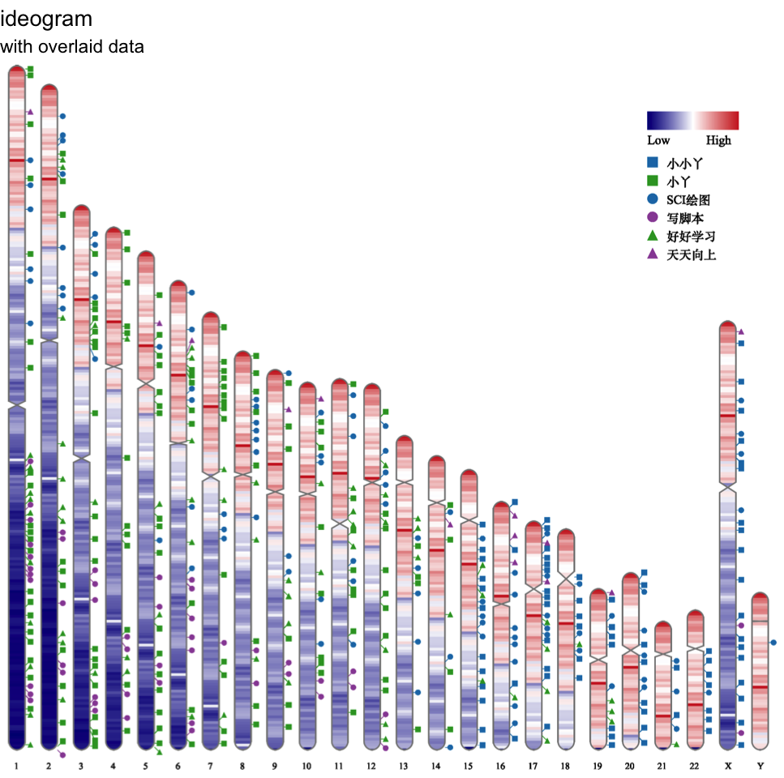

<!-- README.md is generated from README.Rmd. Please edit that file -->
``` r
setwd("inst/example")
karyotype <- read.table("karyotype.txt", sep = "\t", header = T, stringsAsFactors = F)
mydata <- read.table("data_1.txt", sep = "\t", header = T, stringsAsFactors = F)
mydata_interval <- read.table("data_2.txt", sep = "\t", header = T, stringsAsFactors = F)

require(ideogram)

svgfile <- tempfile(fileext = ".svg")
pdffile <- tempfile(fileext = ".pdf")

ideogram(karyotype, mydata, mydata_interval, svgfile)

svg2pdf(svgfile, pdffile)
```

    ## Saving 7 x 7 in image

``` r
p <- pdf2ggplot(pdffile)

p + ggplot2::labs(title = "ideogram", subtitle = "with overlaid data")
```


